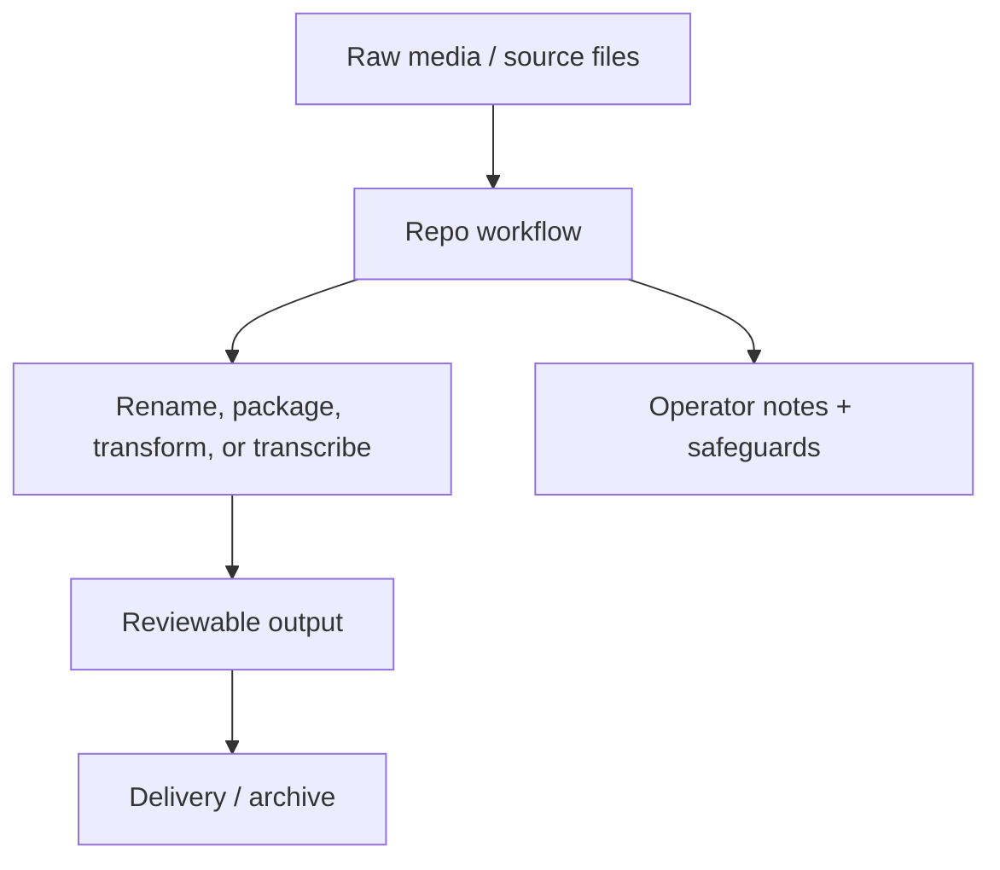

# Coven

   

Local harness substrate for project-scoped agent sessions.

Built and maintained by **DropShock Digital**.

---

## First screen

| Area | Detail |
| --- | --- |
| Repository | [`DropShock-Digital/coven`](https://github.com/DropShock-Digital/coven) |
| Primary class | media workflow / delivery tool |
| Current posture | prototype |
| Default branch | `main` |
| Visibility | public |
| Last README standardization | 2026-06-26 |

## What matters

- Make the repo purpose obvious in the first 30 seconds.
- Put the architecture or workflow in a visual map before deep prose.
- Keep commands, environment notes, and handoff risks close to the top.
- Credit the real builder/maintainer while keeping client or project context separate from implementation notes.
- Audit priority: `P1`

## System map




### Visual proof


## Best features carried forward

- Visual-first GitHub Markdown is kept, but constrained to one clear hero/asset lane.
- Existing Mermaid thinking is preserved and moved near the top as the system map.
- Existing setup intent is kept and reframed as a short operator path.
- Architecture language is retained but converted into a skimmable diagram-first explanation.
- Input → processing → output is treated as the core story, not buried in prose.

## Operate this repo

**Detected stack:** No package/deploy metadata detected yet

```bash
# Add verified setup/run commands here.
```

> Commands above are inferred from repository files and should be verified before they become release or client handoff instructions.

## Documentation map

- [`.github/ISSUE_TEMPLATE/bug-sessions-cache.md`](.github/ISSUE_TEMPLATE/bug-sessions-cache.md)
- [`.github/pull_request_template.md`](.github/pull_request_template.md)
- [`CONTRIBUTING.md`](CONTRIBUTING.md)
- [`LICENSE`](LICENSE)
- [`SECURITY.md`](SECURITY.md)
- [`docs/AGENTS.md`](docs/AGENTS.md)
- [`docs/API-CONTRACT.md`](docs/API-CONTRACT.md)
- [`docs/API.md`](docs/API.md)
- [`docs/ARCHITECTURE.md`](docs/ARCHITECTURE.md)
- [`docs/AUTH.md`](docs/AUTH.md)
- [`docs/BRAND.md`](docs/BRAND.md)
- [`docs/BRANDING-ADHERENCE.md`](docs/BRANDING-ADHERENCE.md)
- [`docs/CASTCODES-INTEGRATION.md`](docs/CASTCODES-INTEGRATION.md)
- [`docs/CLIENT-INTEGRATION.md`](docs/CLIENT-INTEGRATION.md)

## Handoff notes

| Area | Detail |
| --- | --- |
| Secrets | No `.env.example` was detected; add one before documenting environment-specific setup. |
| License | License file detected. |
| Owner credit | Built and maintained by DropShock Digital. |
| Next documentation move | Add `docs/OPERATIONS.md` for runbooks, monitoring, recovery, and common failures. |

## Maintenance standard

This README follows the DropShock repo documentation format: one clear identity, one visual map, a short operator path, explicit ownership, and deeper detail moved into linked docs when needed. If the repo grows, add or update `docs/ARCHITECTURE.md`, `docs/DEPLOYMENT.md`, and `docs/OPERATIONS.md` instead of turning the README into a wall of text.
